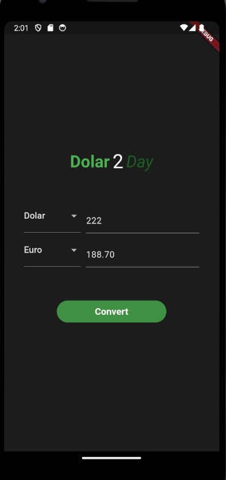

# Dolar today (Dolar2Day)

## About

Create a app for convert money using flutter

## Images



#### Tech

- [Flutter](https://docs.flutter.dev/get-started/install)

### How to use?

To get started, you'll need to have a few tools installed on your machine:
[Git](https://git-scm.com), [Flutter](https://docs.flutter.dev/get-started/install), and you'll also need an emulator. You can find more information on the [Android Studio](https://developer.android.com/studio?hl=pt&gclid=CjwKCAjw1ICZBhAzEiwAFfvFhHLSUJj_5oi2_iujE7QitCc9tE3BjT5DXG-ML2YkUK8BMkz1PWBtWxoCU58QAvD_BwE&gclsrc=aw.ds) you'll need a code editor such as
[VSCode](https://code.visualstudio.com/)

#### Open u cmd and paste this code:

```bash
# for clone repository:
$ git clone git@github.com:Av3z/dolar2day.git

# use this for join folder app:
$ cd dolar2day

# for start the project:
$ flutter run
